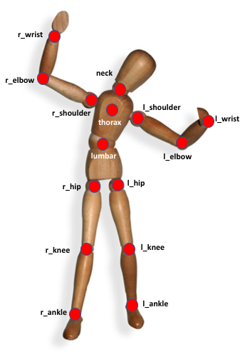

= Eurobench Data Format
:source-highlighter: pygments
:pygments-style: emacs
:icons: font
:toc: right
:linkattrs:
:sectnums:

== Motivation

The experimental datasets expected to populate the EUROBENCH database will engage data coming from a lot of different sensing devices, from different laboratories and will be designed for different benchmarking scenarios and algorithms.
In order to store these experiments in a consistent way, a common, comprehensive and flexible data format is necessary.
Other motivations for the specification of a unique data format and conventions are:

* Ensuring automatic computation of Performance Indicators (PIs) based on recorded data.
* Maximising compatibility between PIs that are common to several protocols (e.g. step length can be calculated in many ways and under many different conditions).
* Allowing data collection and PI computation to happen independently in different times and location (e.g. enabling any remote user to benchmark an experiment performed in a specific laboratory setting).

Any request to extend / change format described here should be done following the <<README.adoc#Modification Instructions, contribution policy>>.

== Data files and format

In this section we propose a common format for the set of files collected during an experiment.
An experiment should correspond to a set of files per run footnote:[Each repetition of an experiment. Synonym of trial (e.g. One experiment has 10 subjects and each subject executes 5 runs).].
This set of files  will be taken as input by a benchmarking routine that, after processing these data, will return a set of benchmarking score(s) (see Figure 1).

[[fig:df_processing_chain]]
.Main elements of the data processing chain
image::img/df_processing_chain.png[align=center, title-align=center]

=== Terminology

Generally speaking, we consider 4 different classes of files related to an experiment:

* **Bipedal system specification**: file providing specification of the dimension of any bipedal system.
  It can be describing a human subject, a humanoid, a prosthesis, an exoskeleton.
* **Testbed configuration** file: provide values for any configuration parameter needed to reproduce the conditions of an experimentation, or a subset of an experimentation.
* **Raw Data**: Data directly collected by the sensors (e.g. marker trajectory).
* **Pre-processed Data**: Sensor-actuator agnostic data acquired during the experimentation.
  The structure of such file is to be compliant with the format agreed in this document.

In the following sections, each of these types of data will be defined and detailed.

=== Filename format, and generalities

Unless specified if different, all datafile recorded will have a name using the following patterns:

.Pre-processed files format
[options="header"]
|================
| File name | Format | Content
| subject_N_run_R_jointAngles  | csv | Joint Angles
| subject_N_run_R_jointTorques | csv | Joint Torques
| subject_N_run_R_jointTrajectories | csv | Joint Trajectories
| subject_N_run_R_grf | csv | Ground reaction Forces
| subject_N_run_R_emg | csv | Electromyography
| wr_N_config_M_segments | yaml | Segments descriptions files
| subject_N_anthropometry | yaml | Anthropometry description
| humanoid_N_anthropometry | yaml | Humanoid description
| subject_N_run_R_gaitEvents | yaml | Gait Events
| subject_N_run_R_testbedLabel | yaml | testbed specifics
|================

where `N` is an integer identifying the human subject (if one is involved), and `R` is an integer identifying the repetition number.
Use appropriate leading zeros for `R` and `N` to ensure proper ordering of files.

Generally speaking, all `csv` files follows the https://en.wikipedia.org/wiki/Comma-separated_values[Comma-separated values] format, using **semicolon** as separator.

In the following documentation, we will use tables for describing file content.
As an example, the following table:

[options="header"]
|=================
| label_1 | label_2 | label_3
| value_1 | value_2 | value_3
|=================

would correspond to a file containing the 2 lines:

[source]
----
label_1; label_2; label_3
value_1; value_2; value_3
----

If a field or a column cannot be filled (the force sensor only provides force measurement, no torque, or all human joint angles are not tracked), the label should be **discarded** from the file (i.e no empty column). This way, the wrench file corresponding to a 6D force sensor (link:https://onrobot.com/sites/default/files/documents/Datasheet_HEX%20QC_20191122.pdf[OnRobot HEX-E QC], for example) would look as follows:
----
time; force_x; force_y; force_z; torque_x; torque_y; torque_z
0; 1.67; 2.34; 0.83; 0.21; 0.53; 0.07
0.001; 1.62; 2.12; 0.75; 0.29; 0.47; 0.1
0.002; 1.63; 2.41; 0.81; 0.19; 0.56; 0.8
.....
----

while the wrench file for a 1D force sensor (link:https://www.tekscan.com/products-solutions/force-sensors/a101[FlexiForce A101 Sensor], for example) would have the following appearance:
----
time; force_x
0; 1.67
0.001; 1.62
0.002; 1.63
.....
----

Note that, depending on the benchmarking algorithm requirements, this may prevent the Performance Indicator computation.

== Bipedal system specification files

Any bipedal system involved in an experiment is to be described by a specification file.
We are promoting the use of the _Unified Robot Description Format_, URDF, both for robotic systems and human subjects.

Note that if an experiment involves a human subject and a wearable device, we expect to get two specification files, one for the human, and another for the wearable.

=== Unified Robot Description Format (URDF) file

**Description**: It is the standard file (written in XML) used in ROS to describe a robot’s model (kinematics, dynamics and sensors).
This file must be provided if the experiments enroll a humanoid robot.
From this file, the number of joints, its labels and the degrees of freedom can be extracted in order to construct the pre-processed joint angles file, and for the definition of the anthropometric file in humanoids.

**Number of files**: all necessary files to describe the complete robotic structure.

**Name of the file**: The main urdf file which includes the rest of urdf files should be named as `humanoid_N_anthropometry`, where `N` is the humanoid number.

**File format**: `.urdf`.
The use of `.urdf` files also has shortcomings such as the lack of friction (important for e.g. walking steeper slope angles).
In order to resolve these issues, EUROBENCH will use Gazebo as a simulator.
This allows to enhance the `.urdf` with `<gazebo/>` tags, permitting the injection of features from the gazebo file format (`.sdf`) while retaining the most common file format, `.urdf`.

=== WR segments description (URDF) file

**Description**: Standard file used in robotics in XML format to describe the dimensions, the physics properties (COM, mass, friction) and inertial properties of each one of the segments of the worn robot.
All these segments are linked by joints (fixed, prismatic, rotational) forming a single tree.
Moreover, it allows to use a wide variety of simulators commonly used in robotics such as Gazebo.

**Number of files**: Usually each segment, sensor, or set of segments such as a leg are described in a single file. Finally the whole robot includes all these files in a single file which is the one loaded.

**Name of the file**: `wr_N_config_M_segments`, where `N` is the WR number and `M` is the configuration number (for resizable robots this could be useful).

**File Format**: .urdf. This format file allows to include Gazebo simulation tags, such as friction properties, or visualization properties that allow to simulate more realistic behaviours.
This file shall contain the dimensions and inertial properties of each segment of the worn robot with respect to the reference system of the human body segment connected to it.
This is needed to enable dynamic simulators to model the human-WR system.

=== Human anthropometric measures file

**Description**: This file shall contain all the anthropometric measurements presented in Table 1 (Winter, 2009) and Figure 3.

**Name of the file**: subject_N_anthropometry, where N = subject’s number.
Use appropriate leading zeros for R and N to ensure proper ordering of files.

**File format**: .yaml

**File structure**: Set of lines containing key: value where the key is provided in Table 2.

.List of body segments ang joints considered in our kinematic model proposed.
[options="header"]
|================
| Group | Segments | Delimiting Joints | key label
.4+| **Upper limb**
  | Hand | wrist axis / 2nd knuckle middle finger | hand
  | Forearm | elbow axis / ulnar styloid | forearm
  | Upper Arm | glenhumeral axis / elbow axis | upper_arm
  | Shoulder| sternoclaviar joint / glenhumeral axis | shoulder
.5+| **Lower limb**
  | Foot | lateral malleolus / head 2nd metatarsal | foot
  | Shank | femoral condyles / medial malleolus | shank
  | Thigh | greater trochanter / femoral condyles | thigh
  | Pelvis | L4-L5 / greater trochanter | pelvis
  | Pelvis width| From hip to hip | pelwis_w
2+| **Head** | C7-T1 & first rip / ear canal | head
2+| **Trunk** | C7-T1 / T12-L1 & diaphragm | trunk
2+| **abdomen** | T12-L1 / L4-L5 | abdomen
|================

Units: Meters

[[fig:df_segment_label]]
.Segments Labels
image::img/df_segment_label.png[align=center, title-align=center]

=== Humanoid anthropometric measures file

**Description**: This file shall contain all the anthropometric measurements from the humanoid robot mapped to the above proposed human segments (see Table 2 and Figure 3).

**Name of the file**: humanoid_N_anthropometry, where N = humanoid’s identifier. Use appropriate leading zeros for R and N to ensure proper ordering of files.

**File format**: .yaml

**File structure**: Set of lines containing key: value where the key must contain the corresponding robot segment name.

**Units**: Meters.

== Testbed configuration file

**Description**: This file shall contain all relevant information for reproducing the experiment in similar conditions.
It can contain values of configuration of the used testbed (e.g. for slope: slope angle; for stairs: step height; etc…).
It can also contain configuration parameters that may be needed by the algorithms for computing the performance indicators.

**File format**: .yaml

**File name**: `subject_N_testbed_T.yaml`, where N = subject’s number, and T can be used to distinguish different configuration settings used in a single experiment.

**File structure**: Set of lines containing key: values.
Where each key is one testbed-related data.
keys must be self-explicative.
Different words on the same key must be separated by underscore.
keys must be written in lowercase.

== Raw Data Files

**Description**: This set of files should contain all data collected directly from the sensory system/s present in the benchmarking scenario (i.e. 3D marker positions, IMUs signals, forces from platforms, etc...).

**Number of files**: One file per run and sensory system should be provided.

**File format**: These files are not supposed to be processed automatically by the EUROBENCH Benchmarking routines, so that a specific format is not defined.
Data can be provided as the device drivers provide them  (e.g. `c3d`, `rosbag`, `.txt`, `.csv`, ...). However, a description of the file content and acquisition frequency should be provided (like `Readme.md` or `Readme.txt`) to help the user opening and understanding these files.

== Pre-Processed Data Files

This set of files should contain all the data processed from the raw data and needed for running a specific benchmarking routine.
As described in each of the following sub-sections, we envision one format per type of information.
These files should be preferably agnostic of the specific sensor used to capture it, so that the benchmarking routines can be launched independently of the acquisition devices.
All time-series files should contain timestamped information, since timestamp reference will be shared by all files describing a same experiment run.

An experiment can provide one or more of the following file types.
If a testbed or a benchmarking routine requires a data type not included in this document, please contact the EUROBENCH Team.
We will work together with you to create the required data file type.

=== Joint angles file

**Description**: This file shall contain the time-series of all measured joint angles, expressed in YXZ Cardan Angles, as defined in the “Angle Definition” section.

**Name of the file**: `subject_N_run_R_jointAngles`  where N = subject’s number and R = run number.
Use appropriate leading zeros for R and N to ensure proper ordering of files.

**File format**: `.csv`

**File structure**:

.Joint angle file structure
[options="header"]
|================
| time | r_hip_y | r_hip_x | r_hip_z | r_knee_y | r_knee_x | r_knee_z | ... | ... | ...
| ... | ... | ... | ... | ... | ... | ... | ... | ... | ...
| ... | ... | ... | ... | ... | ... | ... | ... | ... | ...
|================

.Joint angle file unit
[options="header"]
|================
| time | r_hip_y | r_hip_x | r_hip_z | r_knee_y | r_knee_x | r_knee_z | ... | ... | ...
| `msec` | `deg` | `deg` | `deg` | `deg` | `deg` | `deg` | ... | ... | ...
|================

=== Joint torques file

**Description**: This file shall contain all the measured joint torques.

**Name of the file**: subject_N_run_R_jointTorques  where  N = subject’s number and R = run number.
Use appropriate leading zeros for R and N to ensure proper ordering of files.

**File format**: .csv

**File structure**:

.Joint torque file structure
[options="header"]
|================
| time | r_hip_x | r_hip_y | r_hip_z | r_knee_x | r_knee_y | r_knee_z | ... | ... | ...
| ... | ... | ... | ... | ... | ... | ... | ... | ... | ...
| ... | ... | ... | ... | ... | ... | ... | ... | ... | ...
|================

.Wrench file unit
[options="header"]
|================
| time | r_hip_x | r_hip_y | r_hip_z | r_knee_x | r_knee_y | r_knee_z | ... | ... | ...
| `msec` | `Nm` | `Nm` | `Nm` | `Nm` | `Nm` | `Nm` | ... | ... | ...
|================

=== Joint centers 3D trajectories file

**Description**: This file shall contain all the measured trajectories of the joints.

**Name of the file**: subject_N_run_R_jointTrajectories  where  N = subject’s number and R = run number.
Use appropriate leading zeros for R and N to ensure proper ordering of files.

**File format**: .csv

**File structure**:

.3D joint center file structure
[options="header"]
|================
| time | r_ankle_x | r_ankle_y | r_ankle_z | r_knee_x | r_knee_y | r_knee_z | ... | ... | ...
| ... | ... | ... | ... | ... | ... | ... | ... | ... | ...
| ... | ... | ... | ... | ... | ... | ... | ... | ... | ...
|================

.3D joint center unit
[options="header"]
|================
| time | r_ankle_x | r_ankle_y | r_ankle_z | r_knee_x | r_knee_y | r_knee_z | ..
| `msec` | `mm` | `mm` | `mm` | `mm` | `mm` | `mm` | ... | ... | ...
|================

Possible labels are listed on Figure <<fig:df_joint_center_label>>.

[[fig:df_joint_center_label]]
.Labels of Joints centers

=== Body Center of Mass 3D trajectory

The body Center of Mass (COM) is frequently considered in biomechanics, as it reflects the motion of the whole body.
It is usually defined as _the unique point where the weighted relative position of the distributed mass sums to zero_ (https://en.wikipedia.org/wiki/Center_of_mass[wikipedia])

**Description**: This file shall contain the estimated COM position along time.

**Name of the file**: subject_N_run_R_com  where  N = subject’s number and R = run number.
Use appropriate leading zeros for R and N to ensure proper ordering of files.

**File format**: .csv

**File structure**:

.COM position file structure and unit
[options="header"]
|================
| time | x | y | z
| `sec` | `m` | `m` | `m`
|================

=== Angular Momentum around the Center of Mass

The angular momentum of a body is a vector quantity that represents the magnitude and the direction in which the body rotates about a reference point <<Bennett2010>>.

**Description**: This file shall contain the estimated angular momentum around the COM along time.

**Name of the file**: subject_N_run_R_angularMomentum  where  N = subject’s number and R = run number.
Use appropriate leading zeros for R and N to ensure proper ordering of files.

**File format**: .csv

**File structure**:

.Angular Momentum file structure and unit
[options="header"]
|================
| time | xx | xy | xz | yx | yy | yz | zx | zy | zz
| `sec` | `Js` | `Js` | `Js`| `Js` | `Js` | `Js`| `Js` | `Js` | `Js`
|================
where `Js` stands for Joule second (equivalent to $$kgm²s^{⁻1}$$).

[bibliography]

[[Bennett2010]] [Bennett2010]: B.C Bennett, S.D. Russell, P. Sheth, M. F. Abel. Angular momentum of walking at different speeds. Human Movement Science, 2010 (https://kin.sfsu.edu/sites/default/files/Angular%20momentum%20of%20walking%20at%20different%20speeds.pdf[link])

=== Wrench file

**Description**: This file shall contain wrench (force and torque) measured by a force sensor.

**Name of the file**: subject_N_run_R_wrench where N = subject’s number and R = run number.
Use appropriate leading zeros for R and N to ensure proper ordering of files.

**File format**: .csv

**File structure**:

.Wrench file structure
[options="header"]
|================
| time | force_x | force_y | force_z | torque_x | torque_y | torque_z
| ... | ... | ... | ... | ... | ... | ...
| ... | ... | ... | ... | ... | ... | ...
|================

.Wrench file unit
[options="header"]
|================
| time | force_x | force_y | force_z | torque_x | torque_y | torque_z
| `sec` | `N` | `N` | `N` | `N.m` | `N.m` | `N.m`
|================

=== Ground Reaction Forces file

**Description**: This file shall contain forces measured by force platforms.

**Name of the file**: subject_N_run_R_grf where N = subject’s number and R = run number.
Use appropriate leading zeros for R and N to ensure proper ordering of files.

**File format**: .csv

**File structure**:

.Ground Reaction Forces file structure
[options="header"]
|================
| time | f_x | f_y | f_z | p_x | p_y | p_z | t_x | t_y | t_z
| ... | ... | ... | ... | ... | ... | ... | ... | ...
| ... | ... | ... | ... | ... | ... | ... | ... | ...
|================

where `f` stands for force, `p` for the center of pressure, and `t` for torques.

.Ground Reaction Forces file unit
[options="header"]
|================
| time | f_x | f_y | f_z | p_x | p_y | p_z | t_x | t_y | t_z
| `msec` | `N` | `N` | `N` | `m` | `m` | `m` | `N.m` | `N.m` | `N.m`
|================

=== Electromyography file

**Description**: This file shall contain all the recorded EMG signals from the human subject.

**Name of the file**: subject_N_run_R_emg, where N = subject’s number and R = run number.
Use appropriate leading zeros for R and N to ensure proper ordering of files.

**File format**: .csv

.EMG file structure
[options="header"]
|================
| time | label_1 | ... | labeli | ...
| ... | ... | ... | ... | ...
| ... | ... | ... | ... | ...
|================

where `label_i` is to be a tag described in table <<tab:emg_tags>>.

.EMG file unit
[options="header"]
|================
| time | label_1 | ... | labeli | ...
| `ms` | `mV` | `mV` | `mV` | `mV`
|================

[[tab:emg_tags]]
.List of EMG muscles and labels considered.
[options="header"]
|================
| Muscle | Label
| Abductor Longus | AbLo
| Biceps Femoris | BiFe
| Gastrocnemious Lateralis |GaLa
| Gastrocnemious Medialis | GaMe
| Gluteus Maximus | GlMa
| Gluteus Medialis | GlMe
| Gracilis | Gra
| Peroneus Longus | PeLo
| Rectus Femoris | ReFe
| Sartorius | Sar
| Semimembranosus | SeMe
| Semitendinosus | SeTe
| Serratus Anterior | SeAn
| Soleus | Sol
| Tensor Fascia Latae | TeFa
| Tibialis Anterior | TiAn
| Extensor Digitorum | ExDi
| Vastus Lateralis | VaLa
| Vastus Medialis  |  VaMe
|================

Units: Millivolts.

=== Gait events file

**Description**: This file shall include all detected (or calculated) heel strike and toe off gait events.

**Name of the file**: subject_N_run_R_gaitEvents  where  N = subject’s number and R= run number.
Use appropriate leading zeros for R and N to ensure proper ordering of files.

**File format**: .yaml

**File structure**:Set of lines containing key: vector of values. Where the key is provided on the last column of Table 3.

**File content**: See Table 3

.List of gait events and its considered labelling
[options="header"]
|====================
| Gait Event  | Label
| Right Heel Strike | r_heel_strike
| Left Heel Strike | l_heel_strike
| Right Toe Off | r_toe_off
| Left Toe Off | l_toe_off
|====================

**Units**: Seconds

=== Testbed-related data file

**Description**: This file shall contain all the data that describes the configuration of the specific testbed (e.g. for slope: slope angle; for stairs: step height; etc…).

**File format**: .yaml

**File name**: subject_N_testbedLabel_R where  N = subject’s number, R = run number and testbedLabel is shown in Table 4.
Use appropriate leading zeros for R and N to ensure proper ordering of files.
New testbedLabel can be added in the future, depending on new testbeds available.

.List of labels for testbeds
[options="header"]
|=======================
| Testbed | testbedLabel
| Walking on flat ground | flat
| Walking on slopes | slope
| Walking on stairs | stairs
| Overcoming obstacles | obstacles
| Walking on irregular hard terrains | irregular
| Walking on treadmill | treadmill
| Walking/standing on moving surfaces | moving
| Walking/standing during pushes | pushes
| Standing during manipulation skills | manipulation
| Picking and carrying objects | pickAndCarry
| Chair sitting and standing | chair
| Walking on laterally inclined surfaces | lateral
| Walking on virtual terrains | virtual
| Walking on soft terrains | soft
| Opening/closing doors | door
| Moving in narrow spaces | narrow
| Pushing a shopping trolley | trolley
|=======================

**File structure**: Set of lines containing key: values.
Where each key is one testbed-related data.
keys must be self-explicative.
different words on the same key must be separated by underscore.
keys must be written in lowercase.

=== Human Factor metrics

We propose a common format for the set of files containing data regarding the user subjective evaluations of the experience of using an exoskeleton.
We describe here all questionnaire-like output of an experimentation.
These questionnaires can be filled by an operator observing the experimentation, or by the human subject taking part of the experimentation. This is defined by the related protocol.
Here we focus on the representation of the questionnaires and related answers.

The representation of any questionnaire is divided into two components:

* The description of the questionnaire itself: <<Factor Meta Data File>>
* The representation of the questionnaire answer: <<Factor Data File>>

We propose using `csv` format for both.

==== Factor Meta Data File

**Description**: This file contains the specification of each question of the questionnaire.
That file should be part of the protocol itself.
It should not vary from an experimentation to another.

**Name of the file**: `questionnaire_name.csv`, where `name` should be a unique identifier given to that questionnaire model.

**File format**: `.csv`

**File structure**: a table-like structure with the following content:

.Meta Data File structure sample
[options="header"]
|=======================
| itemID | type | options | text | answer_unit
| 0 | | | This is the title of the questionnaire? |
| 1	| value	| float > 0	| Time required to donning the exoskeleton | sec
| 2	| value	| int>0	| Number of steps climbed and down | number
| 3	| boolean	|	| Did the user stumble when ascending stairs | boolean
| X |	likert |	[[1, "I strongly disagree”, [2, "I disagree”], [3, "I slightly disagree”], [4, "Neutral”], [5, "I slightly agree”], [6. "I agree”], [7, "I strongly agree”]] | The use of the device was very easy. |
| Y	| text | | How is perceived the system by the user |
| Z	| multiselect	| [“Left knee”, “left ankle”, “right knee”, “right ankle”, “none”] |	Were you perceiving unexpected pressure on some limbs? |
| W | select | [“Left knee”, “left ankle”, “right knee”, “right ankle”, “none”]	| Which limb was receiving most pressure? |
|=======================

With:

* `itemID`: unique identifier (in the file) of the item.
  It can be a string, and contain any complex structure.
  The only constraint is that it has to be unique for the given questionnaire.
* `type`: definition of the type of answer expected
** Possible values: `value`, `text`, `boolean`, `likert`, `select`, `multi_select`
* `options`: additional information to represent the answer options (if needed)
* `text`: item text
* `unit`: answer unit indication (if any)

==== Factor Data File

**Description**: This file only contains the answers to each of the question asked.

**Filename** : `subject_N_questionnaire_name.csv`, where `name` refers to the Factor Meta Data File this questionnaire answer is related to.

**File format**: `.csv`

**File structure**: a table structure with the following content:

.Meta Data File structure sample
[options="header"]
|================
| itemID | answer
| 2 | 4
| 1 | 4.8
| Y | "The installation was complex"
| X | 2
| 3 | True
| Z | [0, 3]
| W | 3
|================

With:

* `itemID`: the ID of the question answered, in relation with the questionnaire description file
* `answer`: the response of the person interviewed
* The administration order being implicitly encoded in the row order (i.e first question: 2, 2nd: 1, 3rd: Y, ….

== Angles definition

All the angle definitions here presented are based on the Plug-in Gait model from Vicon.
Joint angles are represented by the YXZ Cardan angles derived by comparing the relative orientations of the proximal (parent) and distal (child) segments around each joint (see Figure 4).

[[fig:df_angle_convention]]
.Representation of the lower limb angle convention. Figure taken from https://docs.vicon.com/display/Nexus25/About+the+Plug-in+Gait+model#AboutthePlug-inGaitmodel-PIGRefs[Vicon Documents: Plugin Gait kinematic variables]
image::img/df_angle_convention.png[align=center, title-align=center]

=== Hip

* **Hip ab/adduction (Relative) (Label: hip_adduction)** Hip adduction is measured in the plane of the hip flexion axis and the knee joint centre.
  The angle is calculated between the long axis of the thigh and the frontal axis of the pelvis projected into this plane.
  A positive number corresponds to an adducted (inwardly moved) leg.

* **Hip flexion/extension (Relative) (Label: hip_flexion)** Hip flexion is calculated about an axis parallel to the pelvic transverse axis which passes through the hip joint centre.
  The sagittal thigh axis is projected onto the plane perpendicular to the hip flexion axis.
  Hip flexion is then the angle between the projected sagittal thigh axis and the sagittal pelvic axis.
  A positive (Flexion) angle value corresponds to the situation in which the knee is in front of the body.

* **Hip rotation (Relative) (Label: hip_rotation)** Hip rotation is measured about the long axis of the thigh segment and is calculated between the sagittal axis of the thigh and the sagittal axis of the pelvis projected into the plane perpendicular to the long axis of the thigh.
  The sign is such that a positive hip rotation corresponds to an internally rotated thigh.

=== Knee

Knee angles are derived from the femur and the untorsioned tibia segments.

* **Knee ab/adduction (Knee valgus/varus) (Relative) (Label: knee_adduction)** This is measured in the plane of the knee flexion axis and the ankle center, and is the angle between the long axis of the shank and the long axis of the thigh projected into this plane.
  A positive number corresponds to varus (outward bend of the knee).

* **Knee flexion/extension (Relative) (Label: knee_flexion)** The sagittal shank axis is projected into the plane perpendicular to the knee flexion axis.
  Knee flexion is the angle in that plane between this projection and the sagittal thigh axis.
  The sign is such that a positive angle corresponds to a flexed knee.

* **Knee rotation (Relative) (Label: knee_rotation)** Knee rotation is measured about the long axis of the shank.
  It is measured as the angle between the sagittal axis of the shank and the sagittal axis of the thigh, projected into a plane perpendicular to the long axis of the shank.
  The sign is such that a positive angle corresponds to internal rotation.
  If a tibial torsion value is present in the Session form, it is subtracted from the calculated knee rotation value.
  A positive tibial torsion value therefore has the effect of providing a constant external offset to knee rotation.

=== Ankle

Ankle angles are derived from the torsioned tibia and the foot segment.

* **Ankle dorsi/plantar flexion (Relative) (Label: ankle_flexion)** The foot vector is projected into the foot sagittal plane.
  The angle between the foot vector and the sagittal axis of the shank is the foot dorsi/plantar flexion.
  A positive number corresponds to dorsiflexion.

=== Foot

In the case of the feet, because they are defined in a different orientation to the tibia segments, an offset of 90 degrees is added to the flexion angle. This does not affect the Cardan angle calculation of the other angles because the flexion angle is the first in the rotation sequence.

* **Foot progression (Absolute) (Label: foot_progression)** This is the angle between the foot vector (projected into the laboratory's transverse plane) and the sagittal laboratory axis. A positive number corresponds to an internally rotated foot.

* **Foot rotation (Relative) (Label: foot_rotation)** This is measured about an axis perpendicular to the foot vector and the ankle flexion axis.
  It is the angle between the foot vector and the sagittal axis of the shank, projected into the foot transverse plane.
  A positive number corresponds to an internal rotation.

=== Shoulder

* **Shoulder ab/adduction (Relative) (Label: shoulder_adduction)** The angle is calculated between the transverse axis of the humerus and the transverse axis of the thorax around a floating sagittal axis.
  A negative number corresponds to an abducted (outwardly moved) arm.

* **Shoulder flexion/extension (Relative) (Label: shoulder_flexion)** Shoulder flexion is calculated about an axis parallel to the thorax transverse axis.
  Shoulder flexion is the angle between the projected sagittal-humerus axis and the sagittal-thorax axis around the fixed transverse axis of the thorax.
  A positive (flexion) angle value corresponds to the situation in which the arm is in front of the body.

* **Shoulder rotation (Relative) (Label: shoulder_rotation)** Shoulder rotation is measured about the long axis of the humerus segment and is calculated between the sagittal axis of the humerus and the sagittal axis of the thorax around a floating frontal axis.
  The sign is such that a positive shoulder rotation corresponds to an internally rotated humerus.

=== Elbow

* **Elbow flexion/extension (Relative) (Label: elbow_flexion)** Elbow flexion is calculated between the sagittal radius axis and the sagittal humerus axis around the fixed transverse axis of the humerus.
  A positive number indicates a flexion angle.

=== Wrist

* **Wrist ab/adduction (Relative) (Label: wrist_adduction)** The angle is calculated between the transverse axis of the hand and the transverse axis of the radius around a floating sagittal axis.
  A positive number corresponds to the hand abducting toward the thumb.

* Wrist flexion/extension (Relative) (Label: wrist_flexion) Wrist flexion is the angle between the sagittal hand axis and the sagittal radius axis around the fixed transverse axis of the radius.
  A positive (flexion) angle value corresponds to the situation in which the wrist bends toward the palm.

* **Wrist rotation (Relative) (Label: wrist_rotation)** Wrist rotation is measured about the long axis of the hand segment and is calculated between the sagittal axis of the hand and the sagittal axis of the radius around a floating frontal axis.
  The sign is such that a positive wrist rotation corresponds to the hand rotating in the direction of the thumb.

=== Waist

* **Pelvic obliquity (Absolute) (Label: pelvis_obliquity)** Pelvic obliquity is measured about an axis of rotation perpendicular to the axes of the other two rotations.
  This axis does not necessarily correspond with any of the laboratory or pelvic axes. Pelvic obliquity is measured in the plane of the laboratory transverse axis and the pelvic frontal axis.
  The angle is measured between the projection into the plane of the transverse pelvic axis and projection into the plane of the laboratory transverse axis (the horizontal axis perpendicular to the subject's axis of progression).
  A negative pelvic obliquity value (down) relates to the situation in which the opposite side of the pelvis is lower.

* **Pelvic rotation (Absolute) (Label: pelvis_rotation)** Pelvic rotation is calculated about the frontal axis of the pelvic coordinate system.
  It is the angle measured between the sagittal axis of the pelvis and the sagittal laboratory axis (axis closest to subject's direction of progression) projected into the pelvis transverse plane.
  A negative (external) pelvic rotation value means the opposite side is in front.

* **Pelvic tilt (Absolute) (Label: pelvis_tilt)** Pelvic tilt is normally calculated about the laboratory's transverse axis.
  If the subject's direction of forward progression is closer to the laboratory's sagittal axis, however, then pelvic tilt is measured about this axis.
  The sagittal pelvic axis, which lies in the pelvis transverse plane, is normally projected into the laboratory sagittal plane.
  Pelvic tilt is measured as the angle in this plane between the projected sagittal pelvic axis and the sagittal laboratory axis.
  A positive value (up) corresponds to the normal situation in which the PSIS is higher than the ASIS.

=== Spine

* **Spine flexion/extension (Relative) (Label: spine_flexion)** Spine flexion is the angle between the sagittal thorax axis and the sagittal pelvis axis around the fixed transverse axis of the pelvis. A positive (flexion) angle value corresponds to the situation in which the thorax is tilted forward.

* **Spine lateral flexion (Relative) (Label: spine_lateralFlexion)** The angle between the long axis of the thorax and the long axis of the pelvis, around a floating transverse axis.

* **Spine rotation (Relative) (Label: spine_rotation)** It is measured as the angle between the sagittal axis of the thorax and the sagittal axis of the pelvis, around a floating frontal axis.
  As the thorax frontal axis points downward while the pelvis frontal axis points upward, a positive angle therefore refers to rotation of the thorax toward the opposite side.

* **Thorax obliquity (Absolute) (Label: thorax_obliquity)** Thorax obliquity is measured about an axis of rotation perpendicular to the axes of the other two rotations.
  This axis does not necessarily correspond with any of the laboratory or thorax axes. Thorax obliquity is measured in the plane of the laboratory transverse axis and the Thorax frontal axis.
  The angle is measured between the projection into the plane of the transverse thorax axis and projection into the plane of the laboratory transverse axis (the horizontal axis perpendicular to the subject's axis of progression.
  As the thorax segment is defined with the frontal Z axis point downward a positive (up) thorax obliquity angle relates to the situation in which the opposite side of the thorax is lower.

* **Thorax rotation (Absolute) (Label: thorax_rotation)** Thorax rotation is calculated about the frontal axis of the thorax coordinate system.
  It is the angle measured between the sagittal axis of the thorax and the sagittal laboratory axis (axis closest to subject's direction of progression) projected into the thorax transverse plane.
  As the thorax segment is defined with the frontal Z axis point downward a positive (internal) thorax rotation value means the opposite side is in front.

* **Thorax tilt (Absolute) (Label: thorax_tilt)** Thorax tilt is normally calculated about the laboratory's transverse axis.
  If the subject's direction of forward progression is closer to the laboratory's sagittal axis, however, then thorax tilt is measured about this axis.
  The sagittal thorax axis is normally projected into the laboratory sagittal plane. Thorax tilt is measured as the angle in this plane between the projected sagittal thorax axis and the sagittal laboratory axis.
  A positive value (up) corresponds to forward thorax tilt.

=== Neck

* **Head obliquity (Absolute) (Label: head_obliquity)** Head lateral tilt is measured about an axis of rotation perpendicular to the axes of the other two rotations.
  This axis does not necessarily correspond with any of the laboratory or head axes.
  Head lateral tilt is measured in the plane of the laboratory transverse axis and the head frontal axis.
  The angle is measured between the projection into the plane of the transverse head axis and projection into the plane of the laboratory transverse axis (the horizontal axis perpendicular to the subject's axis of progression).
  A negative head obliquity value (down) relates to the situation in which the opposite side of the head is lower.

* **Head rotation (Absolute) (Label: head_rotation)** Head rotation is calculated about the frontal axis of the head coordinate system.
  It is the angle measured between the sagittal axis of the head and the sagittal laboratory axis (axis closest to subject's direction of progression) projected into the head transverse plane.
  A negative (external) head rotation value means the opposite side is in front.

* **Head tilt (Absolute) (Label: head_tilt)** Head tilt is normally calculated about the laboratory's transverse axis.
  If the subject's direction of forward progression is closer to the laboratory's sagittal axis, however, then head tilt is measured about this axis.
  The sagittal head axis is normally projected into the laboratory sagittal plane.
  Head tilt is measured as the angle in this plane between the projected sagittal head axis and the sagittal laboratory axis.
  A positive value (up) corresponds to forward head tilt.

* **Neck flexion/extension (Relative) (Label: neck_flexion)** The sagittal head axis is projected onto the plane perpendicular to the thorax sagittal axis.
  Neck flexion is then the angle between the projected sagittal head axis and the sagittal thorax axis around the fixed transverse axis of the thorax.
  A positive (flexion) angle value corresponds to the situation in which the head is tilted forward.

* **Neck lateral flexion (Relative) (Label: neck_lateral_flexion)** The angle between the long axis of the head and the long axis of the thorax around a floating transverse axis.

* **Neck rotation (Relative) (Label: neck_rotation)** Neck rotation is measured about the long axis of the head.
It is measured as the angle between the sagittal axis of the head and the sagittal axis of the thorax, around a floating frontal axis.
As the thorax frontal axis points downward while the head frontal axis points upward, a positive angle therefore refers to rotation of the head toward the opposite side.

== Examples

This section is still under construction. Our intention is to provide a complete set of examples for three fields: human, humanoids, and wearable robots locomotion dataset.

=== Example 1

The Laboratory HumanLab has done a study on Parkinson’s patients and recorded two subjects during overground walking, with inertial sensors. Three runs were recorded per subject. These are the files that they have produced to be compatible with the EUROBENCH Database.

* Raw Files
** raw_data.txt
** subject_01_imu_raw_01.cappa
** subject_01_imu_raw_02.cappa
** subject_01_imu_raw_03.cappa
** subject_02_imu_raw_01.cappa
** subject_02_imu_raw_02.cappa
** subject_02_imu_raw_03.cappa
* Anthropometric Files
** subject_01_anthropometry.yaml
** subject_02_anthropometry.yaml
* Electromyography Files
** subject_01_run_01_emg.csv
** subject_01_run_02_emg.csv
** subject_01_run_03_emg.csv
** subject_02_run_01_emg.csv
** subject_02_run_02_emg.csv
** subject_02_run_03_emg.csv
* Gait Events Files
** subject_01_run_01_gaitEvents.csv
** subject_01_run_02_gaitEvents.csv
** subject_01_run_03_gaitEvents.csv
** subject_02_run_01_gaitEvents.csv
** subject_02_run_02_gaitEvents.csv
** subject_02_run_03_gaitEvents.csv
* Testbed related data file
** subject_01_run_01_flat.yaml
** subject_01_run_02_flat.yaml
** subject_01_run_03_flat.yaml
** subject_02_run_01_flat.yaml
** subject_02_run_02_flat.yaml
** subject_02_run_03_flat.yaml

=== Example 2
The Laboratory ExoLab has done a study on healthy people wearing an H2 exoskeleton and recorded one subject during slope ascending, with optical markers. Two runs were recorded. These are the files that they have produced to be compatible with the EUROBENCH Database.

* Raw Files
** raw_data.txt
** subject_01_markers_raw_01.cappa
** subject_01_markers_raw_02.cappa
* Anthropometric Files
** subject_01_anthropometry.yaml
* Gait Events Files
** subject_01_run_01_gaitEvents.csv
** subject_01_run_02_gaitEvents.csv
* Testbed related data file
** subject_01_run_01_slope.yaml
** subject_01_run_02_slope.yaml

=== Example 3

The Laboratory HumanoidLab has done a study on the new walking pattern generator and recorded the robot during flat ground walking. Two runs were recorded. These are the files that they submit to be compatible with the EUROBENCH Database.

* Raw Files
** rosbag_01.bag (containing /tf topic)
** rosbag_02.bag (containing /tf topic)
** humanoid_markers_raw_01.cappa
** humanoid_markers_raw_02.cappa
* .urdf File
** humanoid_lower_body.urdf
** humanoid_upper_body.urdf
** humanoid_feet.urdf
** humanoid_hands.urdf
* Gait Events Files
** humanoid_01_run_01_gaitEvents.csv
** humanoid_01_run_02_gaitEvents.csv
* Testbed related data file
** humanoid_01_run_01_flat_01.yaml
** humanoid_01_run_02_flat_02.yaml

== References

* David A. Winter. Biomechanics and Motor Control of Human Movement, 4th Edition. Willey (2009)
* https://docs.vicon.com/display/Nexus25/Plug-in+Gait+kinematic+variables[Vicon Documentation: Plug-in Gait kinematics variables]
* https://docs.vicon.com/display/Nexus25/About+the+Plug-in+Gait+model#AboutthePlug-inGaitmodel-PIGRefs[Vison Documentation: About the Plug-in Gait model]
