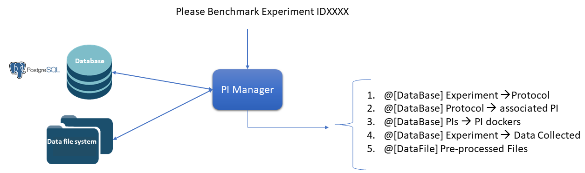
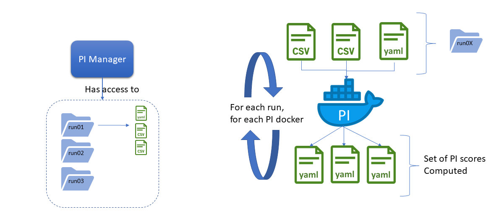

= Performance Indicator Specification
:source-highlighter: pygments
:pygments-style: emacs
:icons: font
#:toc: right
:linkattrs:
:sectnums:

== Introduction

Performance Indicators (or `PIs`) refer to the algorithms used to compute performance metrics for a given experiment and following pre-defined protocol.
In the context of Eurobench, `PIs` are the bases for later performance comparisons between different wearable robotic devices (or humanoids) which have performed comparable experiments.

There exists:

* General PIs related to system ability:
** _Motion ability_: Successful task time, Maximum cadence, Mechanical energy, ...
** _Human Robot Interaction_: Comfort, Muscle fatigue, Metabolic cost, ...
** _Adaptability_: Versatility, Task adaptability,
** _Cognitive_: Intention decoding, Cognitive effort

* Scenario specific PIs
** Scenario _Walking on slopes_: Slope angle the subject can walk up, Maximum velocity the subject can walk up, ...
** Scenario _Walking on stairs_: Step height that the subject can walk up, Maximum number of successive stairs the subject can walk up, ...
** Scenario _Overcoming obstacles_: maximum height of an obstacle the subject can walk over, ...
** Scenario _Picking and carrying objects_: Weight of the object which can be picked up and carried, Walking speed while carrying an object, ...

=== A bit of context: the PI Manager

A key component of the Benchmarking Software is the `PI Manager`.
It is called every time a new experiment is uploaded to the Benchmarking System.
The objective of the `PI Manager` is to orchestrate the computation of the performance metrics for that experiment.

The overall interaction scheme is described on the following figure.
We assume here that an experiment has just been uploaded to the Benchmarking Software, i.e. all experimental data are already uploaded and stored into the database.

The remaining operation is the scoring of the experiment, which is for what is triggered the PI Mananger.
The successive operations conducted by the PI Manager are the followings:

1. From the Experiment ID, the PI Manager gets access from the database to the Protocol this experiment is related to.
2. From the Protocol ID, the PI Manager gets the list of PI algorithms associated to it, along with the PIs calculated by each of theses algorithms.
3. For each algorithm, the PI Manager gets access to the Algorithm Docker identifier
4. From the Experiment ID, the PI Manager locates in the datafile system the folder related to that experiment.
   It contains all the _Pre-Processed files_ uploaded by the experimenter.
5. From the Datafile system, the PI Manager can access to all the experiment files required as parameters / input files to run the algorithm.

[[fig:pim_interact]]
.Global interaction of the PI Manager with the database to collect the experimental data

NOTE: As mentioned, each of the PI routines are encapsulated within a docker image.
      It avoides any dependency conflicts in between the different PI code implementation, and isolates the PI Manager machine from the PI computation effort.

The PI Manager has somehow (to be clarified) a local copy of the experiment files, which can be organized on the left picture of the following figure.

[[fig:pim_loop]]
.Overall PI Manager processing loop

We assume that each run (iteration of the experiment with similar conditions or independent variables), is described by a set of _Pre-processed files_.

Then The PI Manager loops on each run and docker:

* For each run
** gather all pre-processed files associated to that run, together to ny condition files describing the experimental condition.
** For each PI docker,
*** run the PI docker with current run files
*** store each PI score, related to a unique run PI evaluation
** Once each run has been evaluated, the PI Manager compute the global PI score, given the computed PI per run.
** All results are uploaded to the database

Once this loop is achived, the PI scores of that experiment are uploaded into the database.
That way, a future comparison of this experiment with another only consists in consulting the data stored into the database.

**Message to take away**:

* All PI algorithms have to be encapsulated into a docker image
* All PI algorithm should be able to launch computation given the _Pre-Processed files_ associated to a single run.

The preparation of the Docker image containing the processing algorithm will be more extensively detailed later on.

== PI repository structure

To reach that structure, a PI code repository must have the following structure:

[source, sh]
----
README.md
src/
test_data
compile.sh
DockerFile
install.sh
run_pi
----

with:

- `README.md` (or any rich text format): should contain common indications about the repository content, purposes, maintainer, ...
- `src` should gather all the code of the PI algorithm.
   If the code organization is let to the PI algorithm developer, we strongly advice following good software practices.
- `test_data`: folder containing reference input data and associated expected output result that can be used for making code testing.
- `compile.sh`: shell script containing the command to build the program
- `DockerFile`: file indicating how to create the Docker image for that code.
- `install.sh`: shell program indicating how to install all dependencies on a fresh ubuntu machine.
- `run_pi`: script that will be the docker container entry point, and that should launch the PI computation, given an input folder (with all input processing files) and an output folder (to store result files).

We are aiming at such generic repository structure to have a common management scheme for all PI code.

Most of the mentioned files are related to the preparation of the docker image, which will be described in a second phase.
We will now focus on the expected interface of the benchmarking algorithm.

== PI algorithm interface

Independentely of the programming language, we request the entry point (being an executable or a script) to have the interface illustrated on Figure named <<fig:pim_loop>>:

* Input: all preprocessed data file of a single run
* Output: one file per Performance Indicator computed.

It is important noting that the PI algorithm should be able to run provided the data of a **single run**.
Thus, if the experiment contains 5 runs, the algorithm will be called 5 times.

=== Input data

The input data of an experiment can be composed of:

* datafile collected from sensors during the experimentation
* datafile corresponding to benchmarking condition, like robot specification, human specification, testbed configuration, ...

We are considering two options:

* Option 1: assuming all input files will be provided explicitely to the PI programm:

[source, sh]
----
run_pi subject_N_run_R_jointAngles.csv subject_N_anthropometric.yaml testbed.yaml [output_folder]
----

* Option 2: placing all datafile inside a folder (e.g. _data_input_), and gives that folder as input parameter:

[source, sh]
----
run_pi data_input/ [output_folder]
----

Looking at the two options:

* Option1:
** PRO: the algorithm knows directly the name of the file associated to each input information
** PRO there is no filename adjustment needed, we can transmit the file as, i.e `subject_N_run_R_jointAngles.csv`
** CONS: the PI manager needs to know the requested file type, together with the order of definition in the command line.
* Option2:
** PRO: the PI manager does not not have to deal with the previous CONS aspect, the PI call is purelly generic
** CONS: to get the PI subject and run agnostic, the PI manager should rename the file before calling the PI:
*** convert `subject_N_run_R_jointAngles.csv` into `jointAngles.csv`
*** convert `subject_N_anthropometric.yaml` into `anthropometry.yaml`

Right now the first option is implemented.

=== Output data

To be again generic, we are proposing the following output format:

* One file per PI score.
* That file would have a yaml structure indicating the content type.
  For instance:

[source, yaml]
----

type: 'vector'
value: [0.96867, 1.01667, 0.98843, 0.95168, 0.87936, 0.94576, 0.87802, 0.87571, 0.81802, 0.82336]
----

Another option could be gathering all PI outcomes into an unique PI file:

[source, yaml]
----

pi_name: step_time
   type: 'vector'
   value: [0.96867, 1.01667, 0.98843, 0.95168, 0.87936, 0.94576, 0.87802, 0.87571, 0.81802, 0.82336]
pi_name: velocity
   type: 'value'
   value: 0.2
----

Right now, the first option is implemented, i.e. one file per PI score.

Note that providing several PI through a unique source code or algorithm is an option provided to the developer.
But in any case, we should have as many files generated as PI computed.
Indeed, a protocol can have various PI associated to it, each of them being associated to different algorithm or code.

The scoring is performed **per run**.
It is assumed that at the definition of the PI in the database it has been also provided information for:

* computing a unique score from a range of value (like use `mean` for providing an indicative unique step_time for a given run)
* aggregating all PI scores obtained from the N runs (like how to extract an experiment step_time score given all the step_time vectors obatined in the successive runs).
